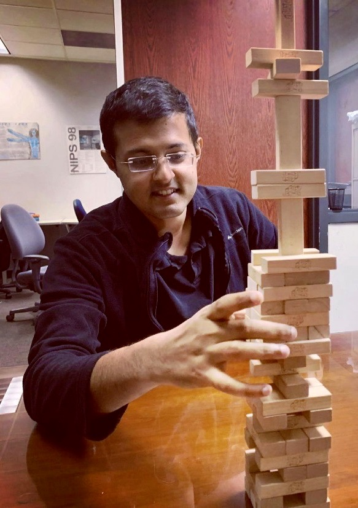

My name is Rishabh Singh. I'm a PhD candidate under the advisement of Dr. Jose C. Principe at the Computational NeuroEngineering Lab (CNEL), University of Florida.

My research involves developing physics inspired information theoretical frameworks for applications such as uncertainty quantification in deep learning, quantification of domain transferability and high resolution information retrieval from data and machine learning models. Visit my Research page to learn more!

PhD (2018 - expected 2022) - University of Florida, USA\
Master of Science (2016 - 2018) - University of Florida, USA\
Bachelor of Technology (2010 - 2014) - Vellore Institute of Technology, India
